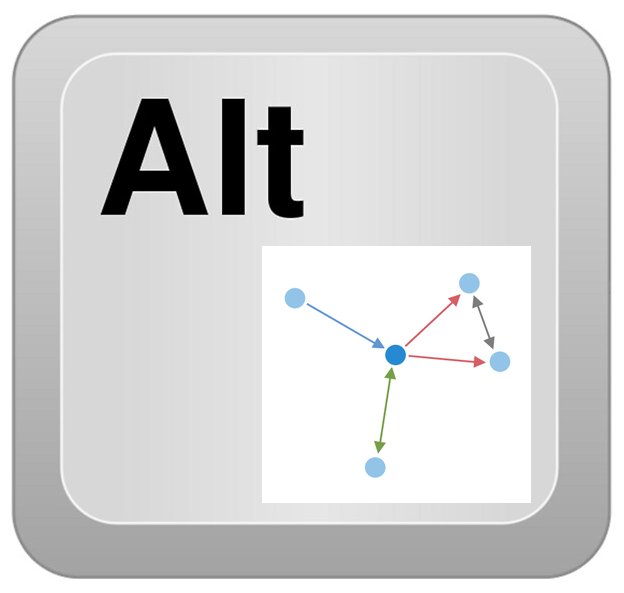
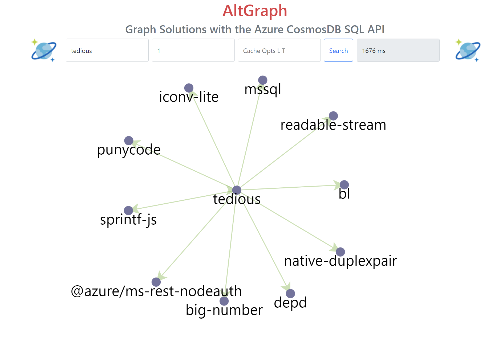
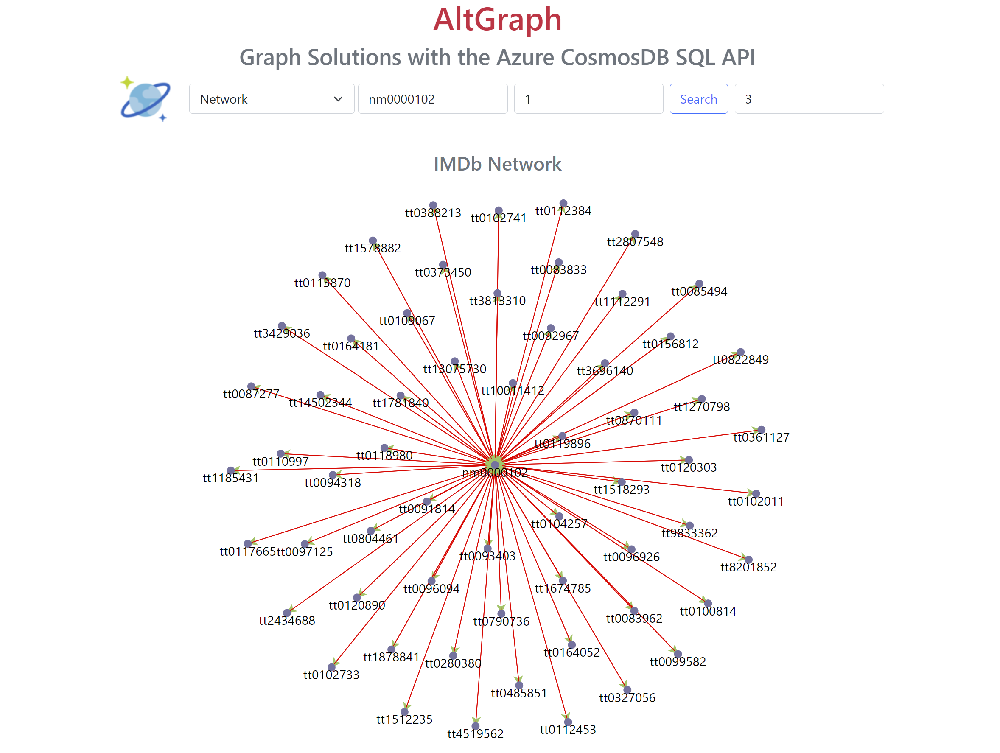

# README for Java Implementations

<p align="center">
    
</p>

**AltGraph is a set of reference applications that demonstrate how to build “graph applications” with Cosmos DB for NoSQL and leverage its’ features to achieve a performant, integrated, and low-cost solutions.  It currently demonstrates two different graph use-cases, with two different implementations.**

Currently, AltGraph is built with the **Java** programming language, and
the **Spring Boot** and **Spring Data** frameworks.  **D3.js** is used in 
the Web UI for visualizations, but you can use any similar JavaScript library
for your implementations.

At this time, **there are two designs and implementations for your reference**:

- A **version 1** design uses the concept of "RDF Triples" to implement a **Bill-of-Materials**
  graph using **NPM** data (the Node Package Manager tool in the Node.js ecosystem).
  The graph of dependencies for a library can be seen as a bill-of-materials.

- A **version 2** design featuring more in-memory functionality and the **JGraphT**
  software library.  This implementation used the **IMDb** (Internet Movie Database) 
  dataset as a very rich social-network.  The large downloadable IMDb datasets
  encourage the exploration of "the six degrees of Kevin Bacon".
  The wrangled AltGraph IMDb data contains over **1-million vertices and 3.9 million edges**,
  all stored in-memory in the JVM (Java Virtual Machine) with JGraphT.

These implementations may be used as-is, or as a starting point for your own implementations.  Both are designed to showcase the power and efficiency of the
**Cosmos DB NoSQL API** for graph solutions.

---

## Example NPM Graph

This example shows a graph of the dependencies for the NPM "tedious" library.

<p align="center">
    
</p>

---

## Example IMDb Graph

This example shows "one-degree of Kevin Bacon".

<p align="center">
    
</p>

---

## Directory Structure of this Repository

```
├── altgraph_data_app       A Java Spring CommandLineRunner (console) application 
└── altgraph_web_app        A Java Spring Web application, see docker-compose.yml
├── az                      az CLI scripts to deploy AltGraph as an Azure Container Instance
├── CosmosDB-AltGraph.pdf   Presentation PDF
```

**Please read the CosmosDB-AltGraph.pdf** document as you first start to explore AltGraph.

## Links

- [Presentation PDF](CosmosDB-AltGraph.pdf)
- [Links](docs/links.md)
- [Setup](docs/setup.md)
- [Implementation Notes](docs/impl.md)
- [AltGraph GitHub Repo](https://github.com/cjoakim/azure-cosmosdb-altgraph)
- [Previous Gremlin Bill-of-Material Repo](https://github.com/Azure-Samples/azure-cosmos-db-graph-npm-bom-sample)
- [Cosmos DB Live TV Episode #59](https://www.youtube.com/watch?v=SGih_Kj_1yk)
- [Cosmos DB Blog](https://devblogs.microsoft.com/cosmosdb/) 

## Primary Developer

```
Chris Joakim, Microsoft, Cosmos DB Global Black Belt (GBB)
```
